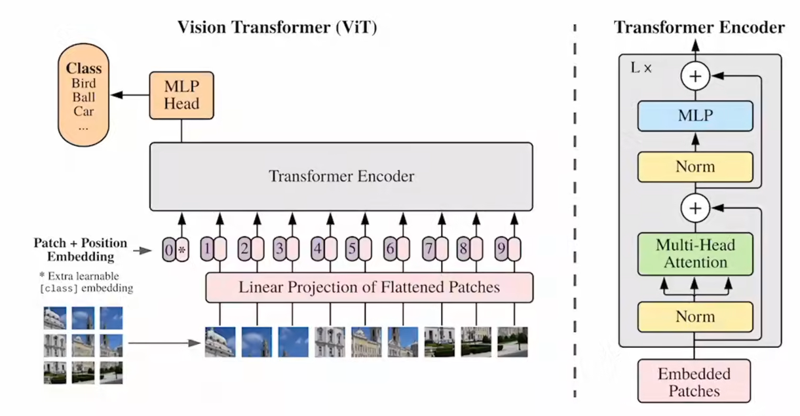
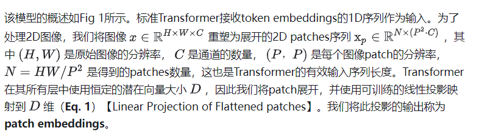
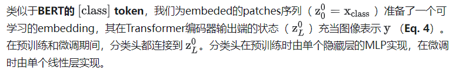
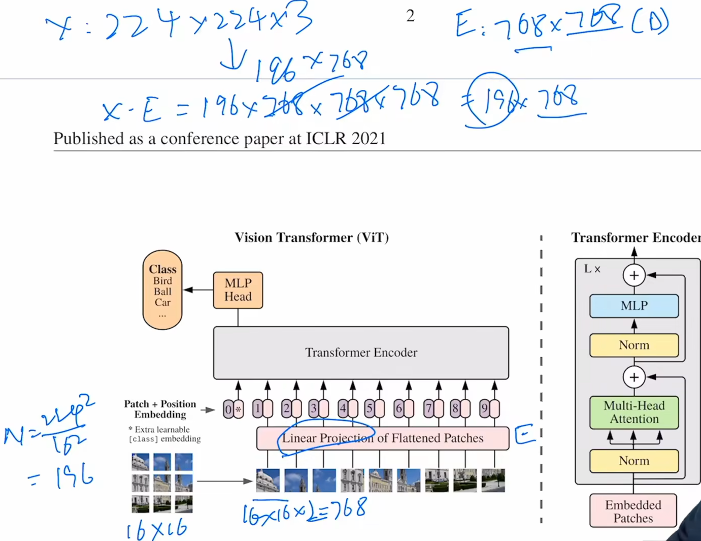
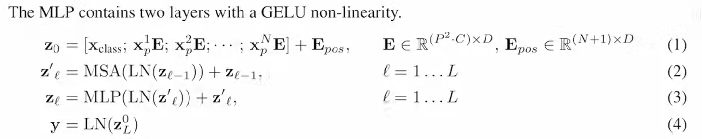
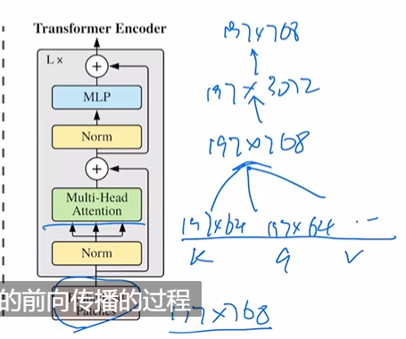
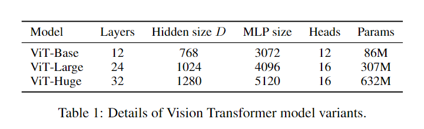
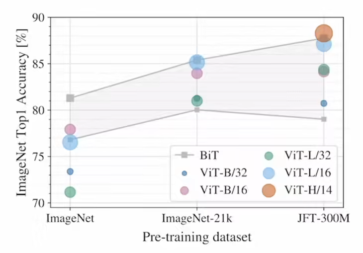

# An Image is Worth 16x16 Words: Transformers for Image Recognition at Scale

Vision transformer（ViT）。

打破CV和Transformer之间的壁垒。


原文链接：https://arxiv.org/abs/2010.11929v1
原文开源代码：https://github.com/google-research/vision_transformer
Pytorch版本代码：https://github.com/lucidrains/vit-pytorch


**一张图片等价于很多16*16的单词：用于大规模图像识别的 Transformer**。


## 1 引言

基于自注意力机制的架构，特别是Transformers，已经成为自然语言处理(NLP)的首选模型。

transformer应用于视觉问题上的难处：

1. 如何把2d的图片，变成1d的序列？瓶颈在可处理序列长度的限制，比如224X224像素的图片，序列长度就是224*224=50176，远大于bert支持的512.

   

本文尝试将<u>标准</u><u>Transformer直接应用于图像</u>，并尽可能减少修改。

为此，我们将图像分割成小块，并提供这些小块的线性嵌入序列作为Transformer的输入。

```python
小块 -> patch，是16*16.

所以，一个224X224像素的图片，原本的序列长度是N=50176，现在就变成：宽度w和高度h=224/16=14，N=14X14=196.
```

小块patches的处理方式与token(单词)相同。我们以有监督的方式对模型进行图像分类训练。

**总结：ViT就是直接用标准的transformer，只需要对图片做预处理，把图片打成块，然后送入transforemer——达到CV和NLP大一统。**


## 2 结论

只有在一开始图像预处理：抽块和位置编码的时候，用了图像特有的归纳偏置。（——就不需要对Vision领域有太多理解）。简单、扩展性好。

（拓展：Swin Transformer）


## 3 方法

### 3.1 ViT及其图像预处理



#### 3.1.1 patch和embedding

把一个图分成很多patch，再把patch打成序列。

1. 每个patch通过一个线性投射层得到一个特征（patch embeddibg）；

2. patch的位置也很重要，所以加上位置编码。




#### 3.1.2 Extra learning token（MLP Head）

**这么多输出，拿哪个输出做分类呢？**借鉴bert，引入特殊字符（类似bert的cls）——使用[class] token，其位置编码永远是0.——Extra learning embedding。

**分类头就连接在这个特殊字符**




> 总结：中心就是在如何把一张图片，变成token序列。


#### 3.1.3 实际走一遍



图片的dimension是：X=224X224X3，这里3是RGB channel。

patch=16X16

N=224X224/(16X16)=196

一个patch的dimension（维度）=16X16X 3=768 (3是RGB channel).

**所以X的维度从224X224X3，变成196X768.**

线性投射层，就是一个全连接层，E=768X768(D).

所以X·E = (196X768) · (768X768) = 196X768.

**表示，我有196个token，每个token向量的维度是768.——成功把CV问题，变成NLP问题，把2d图变成1d tokens。**

从全连接层出来的，就是patch embedding。


[class]特殊字符只有一个token，维度也是768。

**所以最后，整体进入transformer的序列，长度是196+1=197，维度是197*768.**


#### 3.1.4 位置编码

有一张表，表每一行代表位置序号，每一行维度也是768。

把位置编码，加到token向量。


到此完成全部图像预处理。公式如下：



X是patch块，E是线性投射层。

MSA多头自注意力，LN：layernorm，z{l-1}是残差连接。

最后，把**最后一层输出的第一个位置上的zL0，也就是class token对应的输出，当作整体图像的一个特征！！！**


#### 3.1.5 一个完整block的前向传播过程

K维度是197X64，原因是有12个头




### 3.2 微调

存在问题：

图像尺寸变了，<u>预训练好的位置编码</u>就不能用了。

解决方法：插值。但也有局限性。


## 4 实验部分



数据集规模足够大，ViT才能出效果:



ViT做小样本学习，需要探索。


自监督训练：

在NLP里是完形填空（Bert）或者预测下一个词（GPT）。