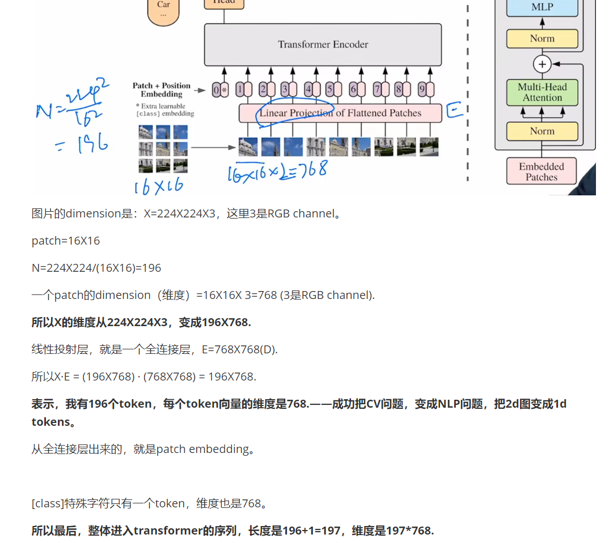

# VLM小白入门

## 1 ViT

Vision transformer模型论文：CV和NLP的统一：

https://github.com/VLM-BeginnerManual/Image/blob/main/01-ViT/Vision-Transformer%E8%AE%BA%E6%96%87.md

## 2 CLIP

论文：Learning Transferable Visual Models from Natural Language Supervision

我的理解和代码：https://github.com/VLM-BeginnerManual/Image/blob/main/01-CLIP/01-CLIP%2BDALLE.ipynb 

